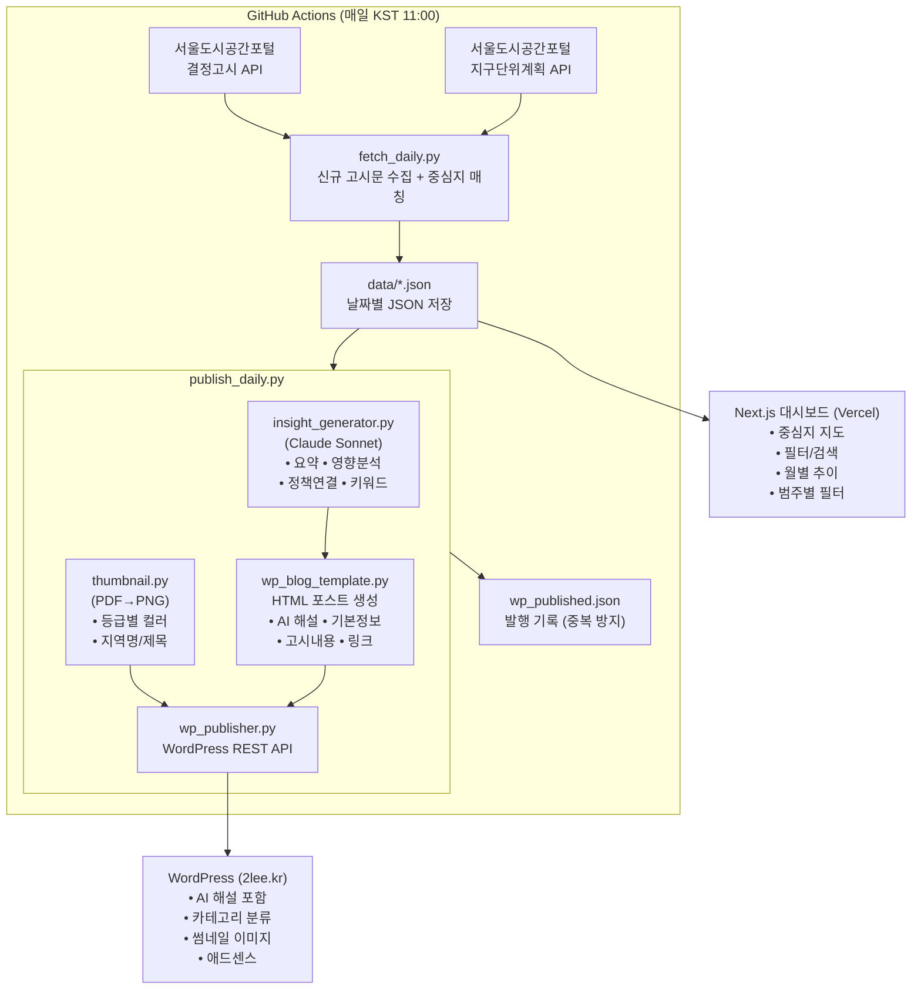

# 서울 도시계획 결정고시 모니터

서울시 도시계획 결정고시·지구단위계획을 매일 자동으로 수집하고, **2040 서울플랜 중심지체계**에 따라 분류하여 보여주는 서비스입니다.

- 블로그: [봉수네 돈공부 (2lee.kr)](https://2lee.kr)
- 대시보드: [seoul-urban-plan-monitor.vercel.app](https://seoul-urban-plan-monitor.vercel.app)

---

## 프로젝트 플로우

## 주요 기능

### 자동 수집
- **결정고시** + **지구단위계획** 매일 수집 (서울도시공간포털 API)
- 2040 서울플랜 22개 중심지 자동 매칭
- 중복 방지, 날짜별 JSON 저장

### AI 인사이트 (Claude Sonnet)
- 고시문 요약 (2~3줄, 쉬운 말)
- 부동산·생활 영향 분석
- 관련 정책 연결 (2040 서울플랜, 강북전성시대 2.0, 서남권 대개조 2.0)
- 키워드 자동 추출

### WordPress 자동 발행
- SEO 최적화 제목
- PDF 기반 썸네일 자동 생성
- 중심지 등급별 카테고리 분류
- 고시 날짜 기준 포스트 날짜 설정

### 대시보드
- 서울 22개 중심지 지도 시각화
- 등급/중심지/키워드/범주 필터
- 월별 추이, 유형 분포, 중심지 랭킹
- 3대 정책 페이지 (서울플랜/강북전성시대/서남권 대개조)

## 2040 서울플랜 중심지체계

| 등급 | 중심지 |
|------|--------|
| **도심** (3) | 한양도성, 여의도·영등포, 강남 |
| **광역중심** (7) | 용산, 청량리·왕십리, 창동·상계, 상암·수색, 마곡, 가산·대림, 잠실 |
| **지역중심** (12) | 동대문, 망우, 미아, 성수, 신촌, 마포, 공덕, 연신내·불광, 목동, 봉천, 사당·이수, 수서·문정, 천호·길동 |

## 기술 스택

| 구분 | 기술 |
|------|------|
| 수집 | Python, requests, GitHub Actions |
| AI | Claude Sonnet API (Anthropic) |
| 이미지 | Pillow, pdf2image (poppler) |
| 발행 | WordPress REST API |
| 대시보드 | Next.js, React, Tailwind CSS, Vercel |
| 지도 | Leaflet |

## 데이터

- 출처: [서울도시공간포털](https://urban.seoul.go.kr) (서울특별시)
- 범주: 결정고시 (43,634건) + 지구단위계획 (4,313건)
- 수집 주기: 매일 자동 (GitHub Actions, KST 11:00)
- 수집 항목: 고시일자, 제목, 본문, 고시기관, 위치, 고시유형, 원문 파일 등
