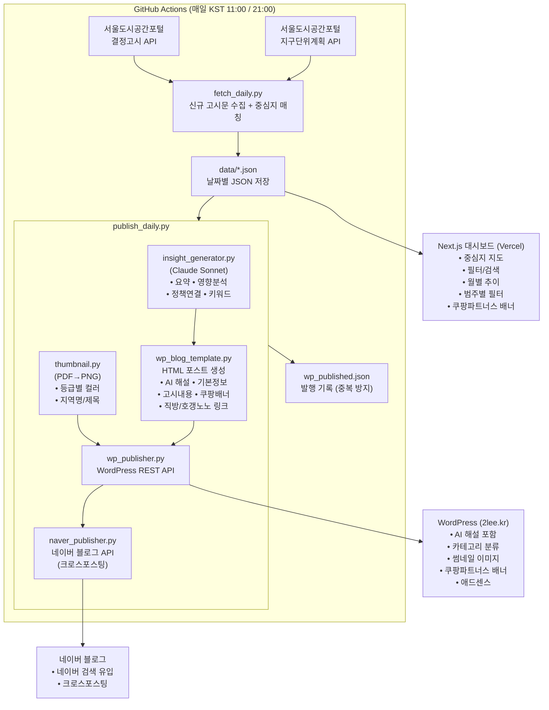

# 서울 도시계획 결정고시 모니터

서울시 도시계획 결정고시·지구단위계획을 매일 자동으로 수집하고, **2040 서울플랜 중심지체계**에 따라 분류하여 보여주는 서비스입니다.

- 블로그: [봉수네 돈공부 (2lee.kr)](https://2lee.kr)
- 대시보드: [seoul-urban-plan-monitor.2lee.kr](https://seoul-urban-plan-monitor.2lee.kr)

---

## 프로젝트 플로우


```mermaid
flowchart TD
    subgraph GHA["GitHub Actions (매일 KST 11:00 / 21:00)"]
        API1["서울도시공간포털<br/>결정고시 API"]
        API2["서울도시공간포털<br/>지구단위계획 API"]
        FETCH["fetch_daily.py<br/>신규 고시문 수집 + 중심지 매칭"]
        DATA["data/*.json<br/>날짜별 JSON 저장"]

        API1 --> FETCH
        API2 --> FETCH
        FETCH --> DATA

        subgraph PUB["publish_daily.py"]
            INSIGHT["insight_generator.py<br/>(Claude Sonnet)<br/>• 요약 • 영향분석<br/>• 정책연결 • 키워드"]
            THUMB["thumbnail.py<br/>(PDF→PNG)<br/>• 등급별 컬러<br/>• 지역명/제목"]
            TEMPLATE["wp_blog_template.py<br/>HTML 포스트 생성<br/>• AI 해설 • 기본정보<br/>• 고시내용 • 쿠팡배너<br/>• 직방/호갱노노 링크"]
            WPAPI["wp_publisher.py<br/>WordPress REST API"]
            NAVER["naver_publisher.py<br/>네이버 블로그 API<br/>(크로스포스팅)"]

            INSIGHT --> TEMPLATE
            THUMB --> WPAPI
            TEMPLATE --> WPAPI
            WPAPI --> NAVER
        end

        DATA --> PUB
        PUB --> PUBLISHED["wp_published.json<br/>발행 기록 (중복 방지)"]
    end

    WPAPI --> WP["WordPress (2lee.kr)<br/>• AI 해설 포함<br/>• 카테고리 분류<br/>• 썸네일 이미지<br/>• 쿠팡파트너스 배너<br/>• 애드센스"]
    NAVER --> NB["네이버 블로그<br/>• 네이버 검색 유입<br/>• 크로스포스팅"]
    DATA --> DASH["Next.js 대시보드 (Vercel)<br/>• 중심지 지도<br/>• 필터/검색<br/>• 월별 추이<br/>• 범주별 필터<br/>• 쿠팡파트너스 배너"]
```

---

## 주요 기능

### 자동 수집
- **결정고시** + **지구단위계획** + **도시계획시설** + **정비사업구역계** 매일 수집
- 2040 서울플랜 22개 중심지 자동 매칭
- 중복 방지, 날짜별 JSON 저장
- 소급 추가분 자동 감지 (Git diff 기반)

### AI 인사이트 (Claude Sonnet)
- 고시문 요약 (2~3줄, 쉬운 말)
- 부동산·생활 영향 분석
- 관련 정책 연결 (2040 서울플랜, 강북전성시대 2.0, 서남권 대개조 2.0)
- 키워드 자동 추출
- 전문가 3인 인용구 생성

### WordPress 자동 발행
- SEO 최적화 제목
- PDF 기반 썸네일 자동 생성
- 중심지 등급별 카테고리 분류
- 고시 날짜 기준 포스트 날짜 설정
- 직방·호갱노노·네이버부동산 실거래가 링크 (구 이름 추출)

### 수익화
- **Google AdSense** — WordPress + Next.js 대시보드
- **쿠팡파트너스 동적 배너** — 키워드기반(id:982014) + 고객관심기반(id:982015)
  - WordPress: "부동산 시장 영향 분석" 섹션 직후 + FAQ 이후
  - Next.js: 고시 상세 페이지 2개소
- **네이버 블로그 크로스포스팅** — 네이버 검색 유입 확보 (활성화 예정)

### 대시보드 (Next.js)
- 서울 22개 중심지 지도 시각화
- 등급/중심지/키워드/범주 필터
- 월별 추이, 유형 분포, 중심지 랭킹
- 3대 정책 페이지 (서울플랜/강북전성시대/서남권 대개조)

---

## 2040 서울플랜 중심지체계

| 등급 | 중심지 |
|------|--------|
| **도심** (3) | 한양도성, 여의도·영등포, 강남 |
| **광역중심** (7) | 용산, 청량리·왕십리, 창동·상계, 상암·수색, 마곡, 가산·대림, 잠실 |
| **지역중심** (12) | 동대문, 망우, 미아, 성수, 신촌, 마포, 공덕, 연신내·불광, 목동, 봉천, 사당·이수, 수서·문정, 천호·길동 |

---

## 기술 스택

| 구분 | 기술 |
|------|------|
| 수집 | Python, requests, GitHub Actions |
| AI | Claude Sonnet API (Anthropic) |
| 이미지 | Pillow, pdf2image (poppler) |
| 발행 | WordPress REST API, 네이버 블로그 API |
| 대시보드 | Next.js, React, Tailwind CSS, Vercel |
| 지도 | Leaflet |

---

## 파일 구조

```
seoul-gosi-crawler/
├── fetch_daily.py          # 고시문 수집 (서울도시공간포털 API)
├── publish_daily.py        # WordPress + 네이버 블로그 발행 오케스트레이터
├── wp_blog_template.py     # WordPress HTML 포스트 생성
├── insight_generator.py    # Claude AI 인사이트 생성
├── naver_publisher.py      # 네이버 블로그 크로스포스팅
├── wp_publisher.py         # WordPress REST API 클라이언트
├── thumbnail.py            # 썸네일 이미지 생성
├── pdf_to_images.py        # PDF → 이미지 변환
├── centers.py              # 2040 서울플랜 중심지 매칭 로직
├── data/
│   ├── YYYY-MM-DD.json     # 날짜별 고시문 데이터
│   ├── wp_published.json   # WordPress 발행 기록
│   └── latest.json         # 마지막 수집 메타데이터
├── prompts/
│   ├── insight_prompt.md   # AI 인사이트 프롬프트
│   └── expert_persona.md   # 전문가 인용구 프롬프트
├── web/                    # Next.js 대시보드
│   └── src/
│       ├── app/            # App Router 페이지
│       └── components/
│           ├── CoupangBanner.tsx   # 쿠팡파트너스 동적 배너
│           └── AdBanner.tsx        # Google AdSense 배너
└── .github/workflows/
    └── fetch-daily.yml     # GitHub Actions 자동화
```

---

## 환경변수 (GitHub Secrets)

| 변수 | 용도 |
|------|------|
| `ANTHROPIC_API_KEY` | Claude AI 인사이트 생성 |
| `WP_URL` | WordPress 사이트 URL |
| `WP_USER` | WordPress 사용자명 |
| `WP_APP_PASSWORD` | WordPress 애플리케이션 비밀번호 |
| `WP_CAT_DSTPLAN` | 지구단위계획 카테고리 ID |
| `NAVER_CLIENT_ID` | 네이버 개발자 앱 Client ID |
| `NAVER_CLIENT_SECRET` | 네이버 개발자 앱 Client Secret |
| `NAVER_ACCESS_TOKEN` | 네이버 OAuth 액세스 토큰 |
| `NAVER_REFRESH_TOKEN` | 네이버 OAuth 리프레시 토큰 |
| `NAVER_BLOG_ID` | 네이버 블로그 ID |

---

## 데이터

- 출처: [서울도시공간포털](https://urban.seoul.go.kr) (서울특별시)
- 범주: 결정고시 + 지구단위계획 + 도시계획시설 + 정비사업구역계
- 수집 주기: 매일 자동 (GitHub Actions, KST 11:00 / 21:00)
- 수집 항목: 고시일자, 제목, 본문, 고시기관, 위치, 고시유형, 원문 파일 등

---

## 로컬 실행

```bash
# 고시문 수집 (신규만)
python fetch_daily.py

# 고시문 수집 (전체)
python fetch_daily.py --full

# WordPress 발행 (최신 10건)
python publish_daily.py --backfill --count 10

# 네이버 블로그 OAuth 최초 인증 (1회)
python naver_publisher.py --auth

# Next.js 대시보드 개발 서버
cd web && npm run dev
```
